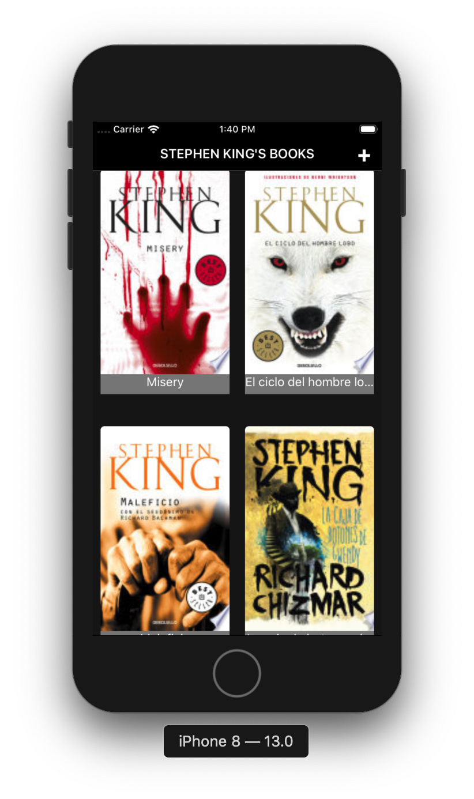
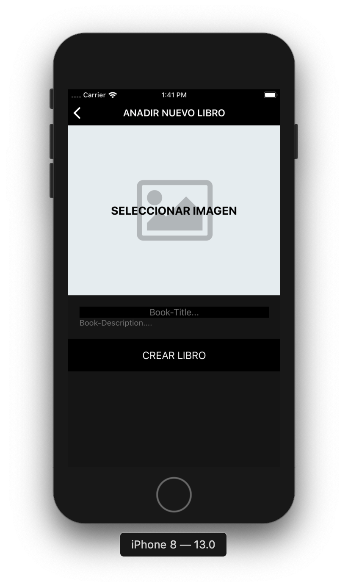

# Práctica de programación React Native

App sobre libros de Stephen King nutrida con datos del API de [Google](https://www.googleapis.com/books/v1/volumes?q=stephen+king&startIndex=0&maxResults=40).

## Características

- Listado de libros de Stephen King
- Detalle con portada, título y descripción de cada uno de los libros
- Posibilidad de añadir tus propios libros

## Preview

## Requisitos

- Homebrew: [Install Homebrew](https://brew.sh/index_es)
- Node.js: [Download Node.js](https://nodejs.org/en/download/)
- Watchman: [Download Watchman](https://facebook.github.io/watchman/docs/install.html)
- React Native: [Getting Started](https://facebook.github.io/react-native/docs/getting-started.html)
- Xcode: [Download Xcode](https://developer.apple.com/xcode/)
- Android Studio + Android SDK: [Download Android Studio](https://developer.android.com/studio/)

## Configuración

Instalar las dependencias del proyecto. Nos colocaremos en su raíz y ejecutaremos `npm install`.

## Instalación

1. Iniciar el servidor Node.js con `npm start`.
2. Instalar la app en iOS con `react-native run-ios` o en Android con `react-native run-android`.
3. Si da problemas con el simulador en ios se puede ejecutar con otra versión con `react-native run-ios --simulator "iPhone 8 (13.0)"`.
